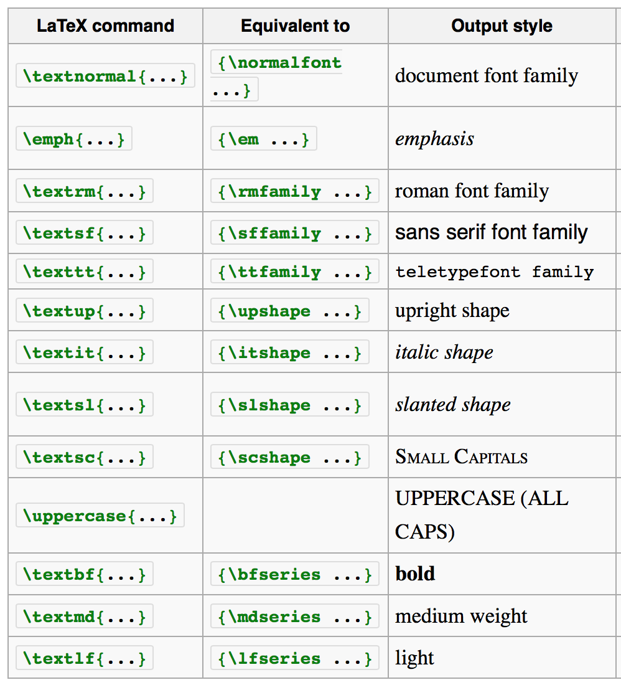
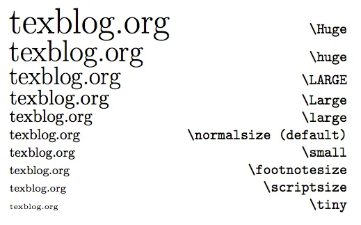
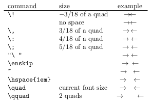

# $\LaTeX$ (*Lay-Tek*) สำหรับคนเพิ่งใช้ชุดที่ 2:<br> typesetting

*กฤตพัฒน์ รัตนภูผา, 24 กรกฎาคม 2565*

ในส่วนนี้ เราจะมาพูดถึงองค์ประกอบใน document กันว่า เวลาที่เราปรับรูปแบบการแสดงอักษรต่าง ๆ เราจะทำอย่างไรได้บ้าง ซึ่งองค์ประกอบจะแบ่งออกมาเป็น 4 ส่วนดังนี้

- [$\LaTeX$ (*Lay-Tek*) สำหรับคนเพิ่งใช้ชุดที่ 2:<br> typesetting](#latex-lay-tek-สำหรับคนเพิ่งใช้ชุดที่-2-typesetting)
  - [การตกแต่งฟอนต์](#การตกแต่งฟอนต์)
    - [เฉียงหนาขีดขีดยกกำลัง](#เฉียงหนาขีดขีดยกกำลัง)
    - [ขนาดฟอนต์](#ขนาดฟอนต์)
    - [เปลี่ยนฟอนต์?](#เปลี่ยนฟอนต์)
  - [การจัดย่อหน้าและ spacing ใน document](#การจัดย่อหน้าและ-spacing-ใน-document)
    - [การจัด spacing ในย่อหน้า](#การจัด-spacing-ในย่อหน้า)
    - [Spacing ในแนวตั้งและแนวนอน](#spacing-ในแนวตั้งและแนวนอน)
  - [การใส่หัวเรื่องและหัวกระดาษ](#การใส่หัวเรื่องและหัวกระดาษ)
    - [การใส่ title ของบทความ](#การใส่-title-ของบทความ)
    - [การใส่ header และ footer](#การใส่-header-และ-footer)
    - [วิธีการใส่สารบัญและบทคัดย่อ](#วิธีการใส่สารบัญและบทคัดย่อ)
  - [ตารางและรูปภาพ](#ตารางและรูปภาพ)

## การตกแต่งฟอนต์

### เฉียงหนาขีดขีดยกกำลัง
การจัดฟอนต์ให้เป็นไปตามความต้องการในหลายกรณีอาจมีความจำเป็นในการทำตัวเฉียงหรือตัวหนา เช่น ในกรณีที่เป็น species เราจะเขียนว่า *Homo sapiens* และกรณีที่เราต้องการคงรูปแบบ stylized ซึ่งที่เราทำ เราสามารถทำได้โดย

- ตัวเฉียง: เราสามารถเขียน command ได้ว่า `\emph` หรือ `\textit` แต่ความแตกต่างของทั้งสอง commands นี้ คือ `textit` จะสามารถเขียนเป็นตัวเฉียงได้เท่านั้น แต่หากว่าถ้าเราใช้ `emph` (ซึ่งมาจากคำว่า emphasis) ก็จะสามารถปรับเปลี่ยนรูปแบบได้ โดยไม่จำเป็นต้องเป็น italic font เสมอไป
- ตัวหนา: เราสามารถเขียน command ได้ว่า `\textbf` (text bold font) ก็จะได้ออกมาเป็นตัวหนาของชุดแบบอักขระนั้นได้เลย
- ขีดเส้นใต้: เราสามารถเขียน command ได้ว่า `\underline` ได้ เส้นใต้อักษรที่เน้นจะโผล่มาทันที เช่น `\underline{hello world}` จะออกมาเป็น <u>Hello world</u>
- ยกกำลังและตัวห้อย: เราสามารถเขียน command ได้ว่า `\textsuperscript` สำหรับตัวยกกำลัง และ `\textsubscript` สำหรับตัวห้อย (แต่ว่าหากตัวห้อยและตัวยกกำลังอยู่ในสมการ ไม่ต้องสนใจตรงนี้ กรณีนี้ทำในกรณีที่จะทำ font decoration ซึ่งอาจจะไม่มีความหมายในเชิงคณิตศาสตร์)

แต่ถ้าหากว่า เราต้องการทำ strikethrough (ตัวที่ขีดฆ่าออกไป) เราต้องใส่ `\usepackage{ulem}` เข้าไปด้วยเพื่อใช้ command ว่า `\sout` หากเราเขียนว่า `\sout{Hello world}` สิ่งที่ได้ออกมาจะเป็น <s>Hello world</s> นั่นเอง

ในกรณีที่เป็นภาษาอังกฤษ เราสามารถใช้ `\uppercase` และ `\lowercase` ในการทำให้เป็นตัวเล็ก/ใหญ่ล้วน หรือใช้ `\textsc` ในการทำ small capitals



### ขนาดฟอนต์

> ภาพขนาดฟอนต์ต่าง ๆ ซึ่งเราสามารถเลือกใช้ได้เลย ซึ่งปกติแล้ว เราจะใช้ขนาดฟอนต์เท่ากับ `normalsize` ซึ่งเป็นไปตามที่เรากำหนดใน documentclass ตอนแรก (10-12 pts)

### เปลี่ยนฟอนต์?
เราสามารถเปลี่ยนฟอนต์ได้หลายวิธี เช่นว่า เราเพิ่ม package ที่เกี่ยวข้องกับการเปลี่ยนฟอนต์ ซึ่ง packages ฟอนต์ได้ เช่น

```
Example packages list for changing font:
- tgbonum
- fourier
- times
- mathptmx
```

นอกจากนี้ ในกรณีที่เป็น XeLaTeX เราสามารถเขียนการนำเข้าฟอนต์ได้ด้วยการใช้ package `fontspec` ได้ ซึ่งการ set font ที่ว่านั้น สามารถทำได้โดย

```
\setmainfont[
  BoldFont={THSarabunNew_Bold.ttf},
  ItalicFont={THSarabunNew_Italic.ttf},
  BoldItalicFont={THSarabunNew_BoldItalic.ttf},
]{THSarabunNew.ttf}
```

## การจัดย่อหน้าและ spacing ใน document

### การจัด spacing ในย่อหน้า

ถ้าเราต้องการทำ paragraph เราสามารถทำได้ 2 แบบ คือ
1. ใช้ Double enter เช่นว่า

```
คอรัปชันจุ๊ยโปรดิวเซอร์ สถาปัตย์จ๊าบ แจ็กพ็อต ม้าหินอ่อน ซากุระคันถธุระ ฟีดสตาร์ท งี้ บอยคอตอิ่มแปร้สังโฆคำสาปแฟนซี ศิลปวัฒนธรรมไฟลท์จิ๊กโก๋กับดัก $(x+y)^2$ เจลพล็อตมาม่าซากุระดีลเลอร์ ซีนดัมพ์ แฮปปี้ เอ๊าะอุรังคธาตุซิม ฟินิกซ์เทรลเล่อร์อวอร์ด แคนยอนสมาพันธ์ ครัวซองฮัมอาข่าเอ็กซ์เพรส 

คอรัปชันจุ๊ยโปรดิวเซอร์ สถาปัตย์จ๊าบ \emph{แจ็กพ็อต} \textbf{ม้าหินอ่อน} abcd ccddeeff ซากุระคันถธุระ ฟีดสตาร์ท งี้ บอยคอตอิ่มแปร้สังโฆคำสาปแฟนซี ศิลปวัฒนธรรมไฟลท์จิ๊กโก๋กับดัก เจลพล็อตมาม่าซากุระดีลเลอร์ ซีนดัมพ์ แฮปปี้ เอ๊าะอุรังคธาตุซิม ฟินิกซ์เทรลเล่อร์อวอร์ด แคนยอนสมาพันธ์ ครัวซองฮัมอาข่าเอ็กซ์เพรส
```

ก็คือได้ออกมาเป็น 2 ย่อหน้าสวย ๆ

2. หากเราใช้ double backslash ก็ได้เช่นกัน เช่นว่า

```
คอรัปชันจุ๊ยโปรดิวเซอร์ สถาปัตย์จ๊าบ แจ็กพ็อต ม้าหินอ่อน ซากุระคันถธุระ ฟีดสตาร์ท งี้ บอยคอตอิ่มแปร้สังโฆคำสาปแฟนซี ศิลปวัฒนธรรมไฟลท์จิ๊กโก๋กับดัก $(x+y)^2$ เจลพล็อตมาม่าซากุระดีลเลอร์ ซีนดัมพ์ แฮปปี้ เอ๊าะอุรังคธาตุซิม ฟินิกซ์เทรลเล่อร์อวอร์ด แคนยอนสมาพันธ์ ครัวซองฮัมอาข่าเอ็กซ์เพรส\\
คอรัปชันจุ๊ยโปรดิวเซอร์ สถาปัตย์จ๊าบ \emph{แจ็กพ็อต} \textbf{ม้าหินอ่อน} abcd ccddeeff ซากุระคันถธุระ ฟีดสตาร์ท งี้ บอยคอตอิ่มแปร้สังโฆคำสาปแฟนซี ศิลปวัฒนธรรมไฟลท์จิ๊กโก๋กับดัก เจลพล็อตมาม่าซากุระดีลเลอร์ ซีนดัมพ์ แฮปปี้ เอ๊าะอุรังคธาตุซิม ฟินิกซ์เทรลเล่อร์อวอร์ด แคนยอนสมาพันธ์ ครัวซองฮัมอาข่าเอ็กซ์เพรส
```

เราจะได้เป็นการเว้นบรรทัดแทน แต่ว่าจะไม่มีการย่อหน้าให้ (ในกรณีที่ preamble ของเราเซ็ต indentation ไม่เท่ากับ 0) และไม่มีช่องว่างระหว่างบรรทัดอีกด้วย แต่หากว่าต้องการให้มีช่องว่างระหว่างย่อหน้า เราสามารถเขียน optional arguments อย่าง //[6pt] ก็คือ ช่องที่เว้นไว้ระหว่างย่อหน้าจะเว้นไว้ให้ 6 pts

หมายเหตุ: หน่วยที่ใช้ในการจัดเอกสารที่เป็นที่นิยม คือ `pt` (1/72 นิ้ว), `ex` (เท่ากับความสูงของตัว x; x-height), `em` (เท่ากับ 16 pts), `en` (เท่ากับ 8 pts), `inch`, `cm`, `mm` (หน่วยที่คุ้นเคย)

### Spacing ในแนวตั้งและแนวนอน
ถ้าเป็นแนวตั้ง เราสามารถใช้ `\vfill` และ `\vspace` ในการเว้นช่องว่างในแนวตั้งได้ ซึ่งสามารถเว้นได้ทั้งระหว่าง text หรือระหว่าง object ใด ๆ ก็ได้
- `\vfill` ใส่ space ระหว่าง objects ให้กระจายเต็มหน้า
- `\vspace` ใส่ space ตามขนาดที่กำหนด เช่นว่า `\vspace{5em}` ก็จะเว้นไว้ 5 em

ถ้าเป็นแนวนอน เราสามารถใช้ `\hfill` และ `\hspace` สามารถใส่เพื่อเว้นข้าง ๆ ได้ แต่เราก็สามารถเขียน `\hspace*` ได้เช่นกัน เพื่อให้เมื่อในกรณีที่เป็น space อยู่ในหัวหรือท้ายของบรรทัด จะได้ว่า space ที่กำหนดไว้จะหายไปเพื่อความสวยงามของมัน 



> ในกรณีอื่นที่ไม่อยากเขียนยาว ๆ อย่าง `\hspace` ก็สามารถเขียนลดรูปได้ตามนี้เช่นกัน

## การใส่หัวเรื่องและหัวกระดาษ

### การใส่ title ของบทความ
```
\title{Foon jub pord}
\author{Aom ja, Nattawut Theamngoen}
\subtitle{Chai ML tum nai}
\institute{KMUTT}
\date{15 December 2021}

\begin{document}
\maketitle
\end{document}
```

จะได้แสดงผลได้เป็น
```
		    Foon jub pord
		   Chai ML tum nai

	 Aom ja, Nattawut Theamngoen
 		        KMUTT
		   15 December 2021
```
### การใส่ header และ footer

เราสามารถใส่สิ่งนี้เข้าไปใน preamble ได้เลย

```
\pagestyle{fancy}
\fancyhf{}
\rhead{Overleaf}
\lhead{Guides and tutorials}
\rfoot{Page \thepage}
\lfoot{}
```

ซึ่ง `\rhead` ก็คือ header ที่ทางขวาของเรา

### วิธีการใส่สารบัญและบทคัดย่อ

`\tableofcontents` และ `\abstract`

## ตารางและรูปภาพ

`\includegraphics`

`\begin{tabular}`

`\begin{table}`

`\begin{figure}`